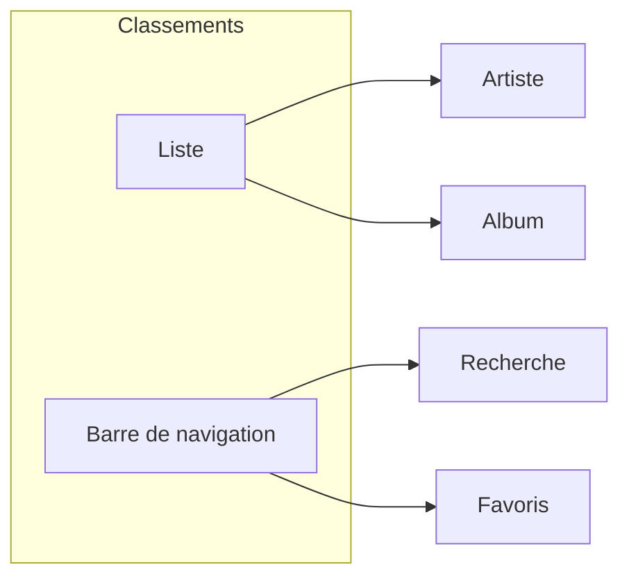
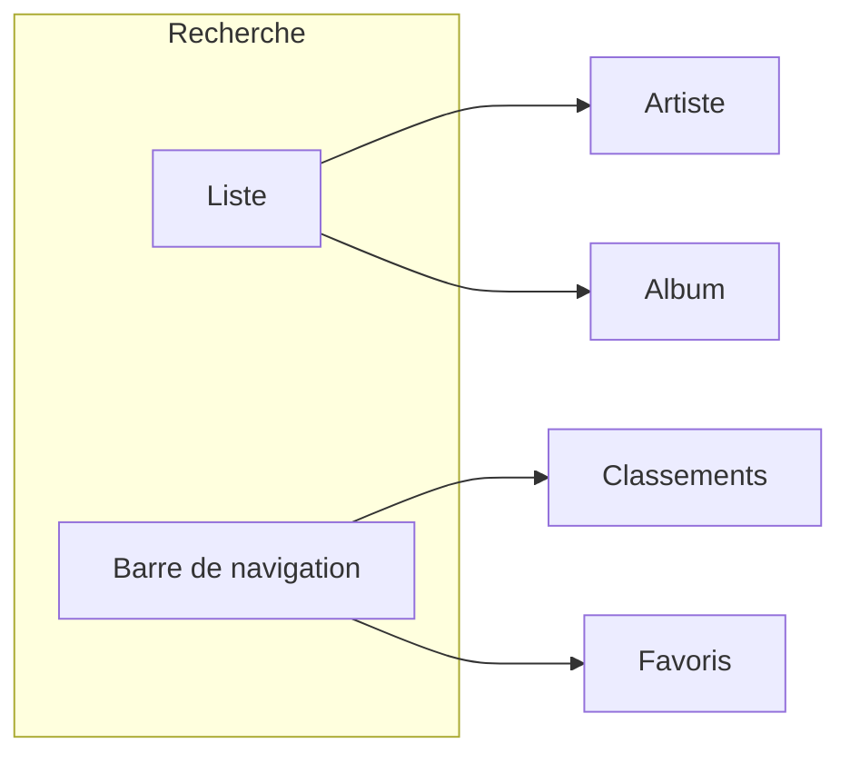
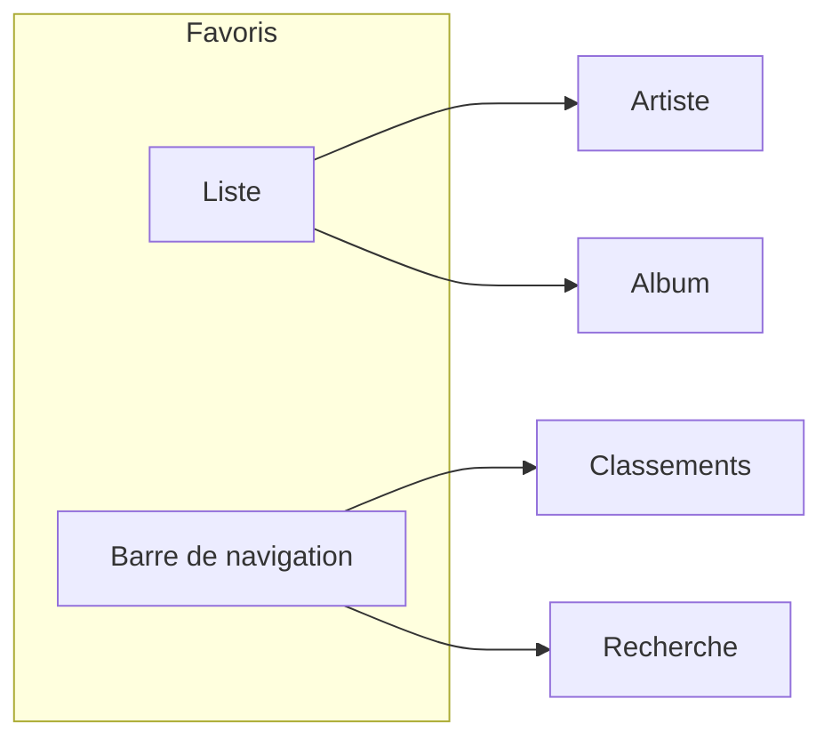
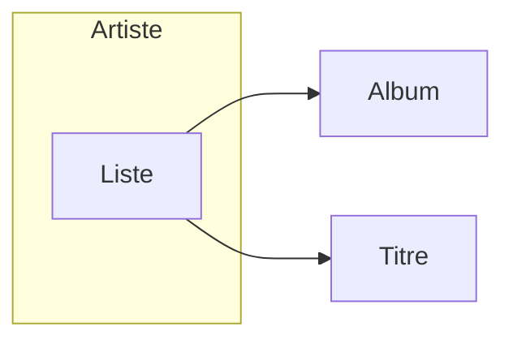
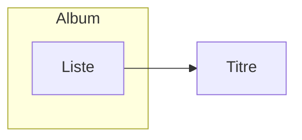

# AudioDB

Cette application mobile utilise les données de l'API TheAudioDB pour présenter des informations autour de la musique :
- artistes
- albums
- titres

Nous nous servons également de l'API chartlyrics qui permet de récupérer les paroles des chansons via une API SOAP.

## Fonctionnalités implémentées
### Page d'accueil (Classements)
Cette page présente les classements itunes pour les titres et les albums, répartis sur deux onglets.

Il est possible de naviguer vers la page Artiste ou la page Album par clic sur un élément de la liste.

Une barre de navigation permet d'accéder à la page Recherche ou Favoris.

Navigation :

### Page Recherche

Cette page permet de réaliser une recherche par artiste. 
- Saisir un nom d'artiste dans le champ de recherche et appuyer sur le bouton associé.
- Le résultat s'affiche pour cet artiste et toute sa discographie.

Par clic sur l'artiste ou un de ses albums, on accède respectivement à la page Artiste ou la page Album.

### Page Favoris
Cette page permet d'afficher les favoris de l'utilisateur, sous forme d'artistes et d'albums stockés dans la base de données locale SqLite.

Par clic sur un artiste ou un album, on accède respectivement à la page Artiste ou la page Album.

### Page Artiste
Cette page affiche le détail d'un artiste.
- description
- albums
- titres les plus appréciés

Elle donne la possibilité d'ajouter ou retirer cet artiste des favoris par un clic sur le coeur.

Par clic sur un album ou un titre, on accède respectivement à la page Album ou la page Titre.

### Page Album
Cette page affiche le détail d'un album.
- description
- titres de l'album

Elle donne la possibilité d'ajouter ou retirer cet album des favoris par un clic sur le coeur.

Par clic sur un titre, on accède à la page Titre.

### Page Titre
Cette page affiche les paroles d'une chanson quand celle-ci est disponible, sinon elle affiche un texte qui précise à l'utilisateur qu'elle ne l'est pas.

### Précisions
- l'application tient compte de la langue du téléphone grâce aux Strings et à la getLocal pour les descriptions Album et Artist.
- comme vu avec vous lors du CC précédent, la navigation ne fonctionne pas pour le retour en arrière: celle-ci quitte l'application. Nous avons néanmoins inclu la fonctionnalité onBackPressed qui aurait été implémenté si elle fonctionnait. Nous sommes à l'écoute de vos retours si vous parvenez à trouver un correctif. Il nous semble cependant que lors de l'analyse du dernier CC, nous n'avions déjà pas pu solutionner ce problème.
