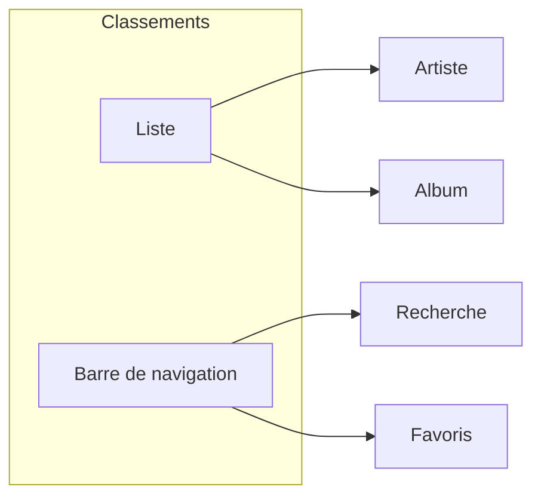
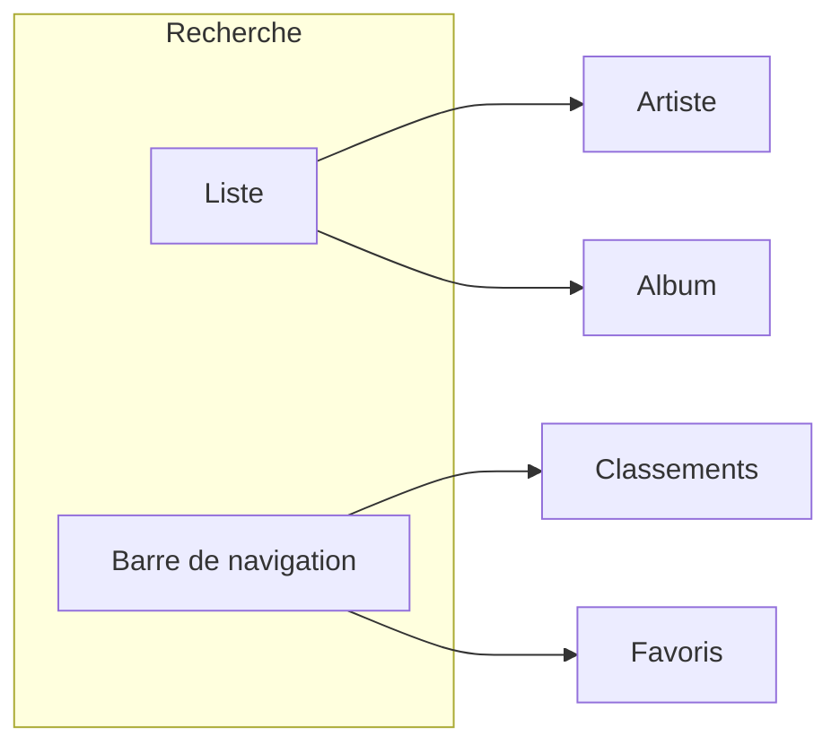
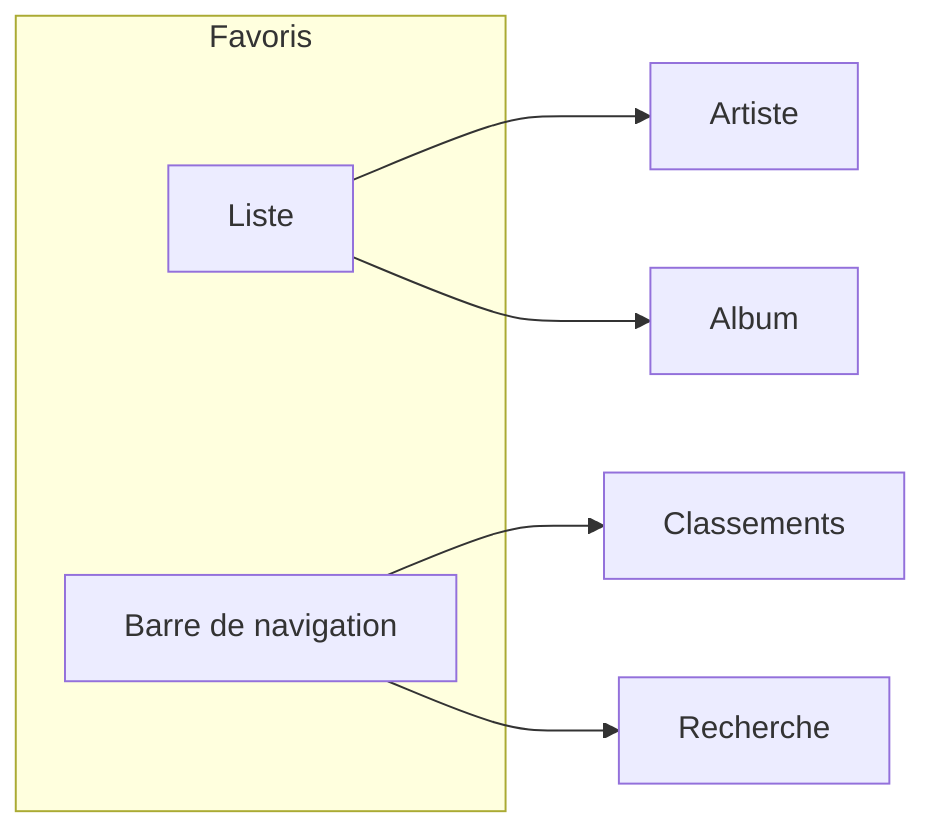
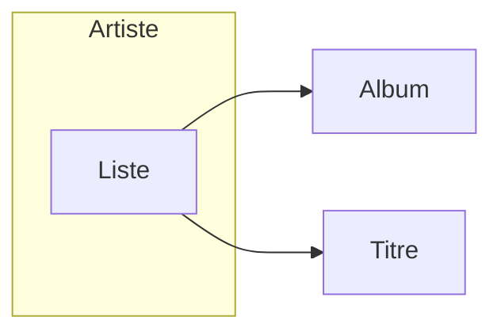
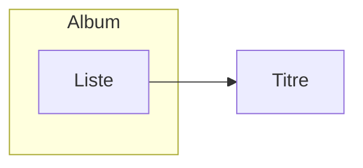

# AudioDB

Cette application mobile utilise les données de l'API TheAudioDB pour présenter des informations autour de la musique :
- artistes
- albums
- titres

## Fonctionnalités implémentées
### Page d'accueil (Classements)
Cette page présente les classements itunes pour les titres et les albums, répartis sur deux onglets.

Il est possible de naviguer vers la page Artiste ou la page Album par clic sur un élément de la liste.

Une barre de navigation permet d'accéder à la page Recherche ou Favoris.

Navigation :

### Page Recherche

Cette page permet de réaliser une recherche par artiste. 
- Saisir un nom d'artiste dans le champ de recherche et appuyer sur le bouton associé.
- Le résultat s'affiche pour cet artiste et toute sa discographie.

Par clic sur l'artiste ou un de ses albums, on accède respectivement à la page Artiste ou la page Album.

### Page Favoris
Cette page permet de réaliser une recherche par artiste. Elle affiche le résultat de cet artiste et toute sa discographie.

Par clic sur un artiste ou un album, on accède respectivement à la page Artiste ou la page Album.

### Page Artiste
Cette page affiche le détail d'un artiste.
- description
- albums
- titres les plus appréciés

Elle donne la possibilité d'ajouter ou retirer cet artiste des favoris par un clic sur le coeur.

Par clic sur un album ou un titre, on accède respectivement à la page Album ou la page Titre.

### Page Album
Cette page affiche le détail d'un album.
- description
- titres de l'album

Elle donne la possibilité d'ajouter ou retirer cet album des favoris par un clic sur le coeur.

Par clic sur un titre, on accède à la page Titre.

### Page Titre
Cette page affiche les paroles d'une chanson.

### Précisions
- l'application tient compte de la langue du téléphone graçe aux Strings et à la getLocal pour les descriptions Album et Artist.
- comme vu précédement avec vous lors du CC précédent la navigation ne fonctionne pas pour le retour en arrière, celle ci quitte l'application, on a néanmoins implémentées le onBackPressed qui aurait été implémenté si elle fonctionnait. Nous sommes preneur de vos retoure si vosu arrivez à fixe le problème mais il me semble que pur le CC nous n'avions déjà pas pu fix ce problème.
